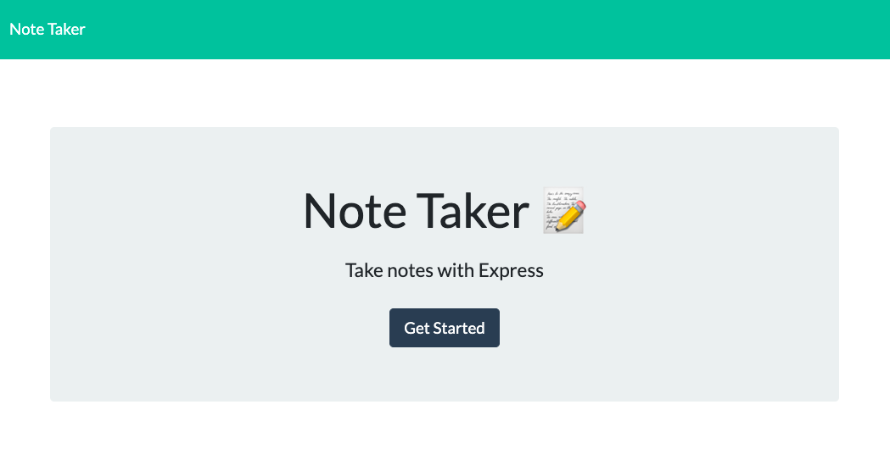
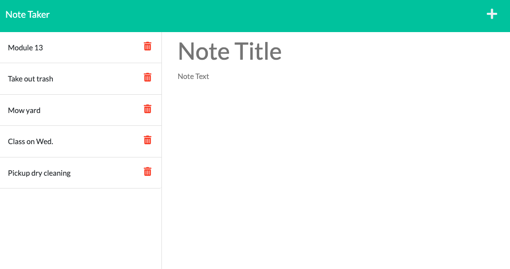
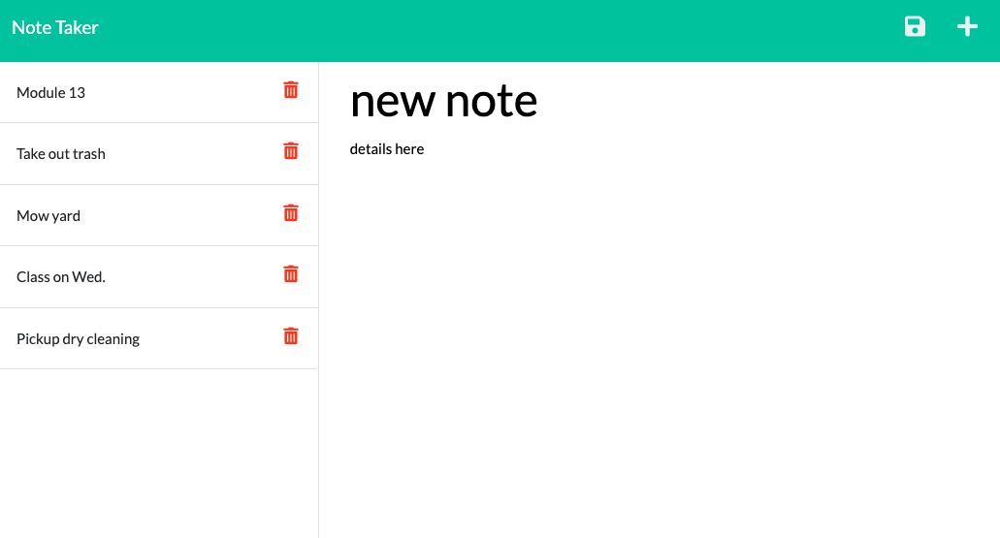

  
  # Express Note Taker

  
  
  
  

  

  Express Note Taker can be used to write, delete, and save notes. This application uses Express.js on the back end saves the note data to a JSON file. 

  # Table of Contents
  * [Usage](#usage)
  * [License](#license)
  * [Contribute](#contribute)
  * [Questions](#questions)
  * [Github Profile](#github)
  * [Deployed App](#herokudeployedapp)
    
  ## Usage
  Click on the link under `Deployed App` to go to the app and click `Get Started`. If any notes are present they will be shown on the left. If you click on a note it's contents will be displayed on the right. You can add, view, or delete notes. When you have entered a new note click the save (disk icon) button to save it. If you are viewing a note you can click the plus button to create a new note. The following images demonstrate this.

  Home page on Heroku 
  
  
  
  Notes displayed on left 
  
  
  
  Save button appears when you add new note 
  
  
  
  ## License
  This software is under the [MIT](./LICENSE) license.
  ## Contribute
  Refer to [Contributor Covenant](https://www.contributor-covenant.org/) for contribution guidelines.

  ## Questions
  Contact author at bagley@umn.edu for questions or to report issues.
  ## GitHub
  https://github.com/bagl0025/express-note-taker
  
  ## HerokuDeployedApp
  https://cryptic-wildwood-48351.herokuapp.com
  
